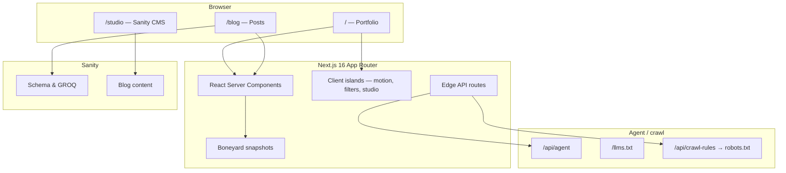

# Architecture.md

**Product:** hectormendoza.me  
**Stack:** Next.js 16 · React 19 · Tailwind CSS 4 · Sanity 6 · Boneyard · Vitest

This document describes how the systems fit together and where changes should land.

---

## 1. High-level view



| Layer | Responsibility |
| --- | --- |
| `app/` | Routes, layouts, metadata, API handlers |
| `components/` | UI sections, blog UI, motion primitives |
| `lib/` | Static project data, helpers, hooks, tests |
| `sanity/` | Schema, client, GROQ queries, image helpers |
| `bones/` | Prebuilt skeleton snapshots for Boneyard |
| `public/` | Static assets, `llms.txt`, logos |

---

## 2. Rendering model

- **App Router** with React Server Components by default.
- Interactive surfaces (`"use client"`) are isolated: hero motion, project filters, theme-sensitive widgets, Studio, toasts.
- Root layout (`app/layout.jsx`) owns fonts, global atmosphere (`GlassGradientBackground`), error boundary, toaster, and Person JSON-LD.
- Home is a thin server page that renders `PortfolioHome`, which composes section components.

### Key routes

| Route | Role |
| --- | --- |
| `/` | Portfolio home |
| `/blog` | Post index |
| `/blog/[slug]` | Post detail |
| `/studio/[[...tool]]` | Embedded Sanity Studio |
| `/bones` | Boneyard snapshot target |
| `/api/agent` | Edge JSON profile |
| `/api/crawl-rules` | Crawl policy (rewritten as `/robots.txt`) |

### Next config behaviors (`next.config.mjs`)

- Rewrites `/robots.txt` → `/api/crawl-rules`
- Redirects legacy theme paths (`/theme/*`, `/light`, `/pastel`) to `/`
- Emits `Link` headers on `/` for agent, llms, and sitemap discovery
- Allows Sanity CDN + placeholder image hosts; `images.unoptimized: true`

---

## 3. Content architecture

### Static portfolio data

Projects and related presentation metadata live in `lib/projects.js`. UI sections import this module directly. Agent JSON and `llms.txt` currently **mirror** a curated subset — keep them aligned when projects or bio change.

### Sanity blog

| Piece | Location |
| --- | --- |
| Schema | `sanity/schemaTypes/post.ts`, `blockContent.ts` |
| Client / env | `sanity/lib/client.ts`, `sanity/env.ts` |
| Queries | `sanity/lib/queries.ts` |
| Studio config | `sanity.config.ts`, route under `app/studio` |

Posts use Portable Text. The site degrades gracefully when Sanity env vars are absent (home still works; blog depends on CMS connectivity).

Env vars (see `.env.local.example`):

- `NEXT_PUBLIC_SANITY_PROJECT_ID`
- `NEXT_PUBLIC_SANITY_DATASET`
- `NEXT_PUBLIC_SANITY_API_VERSION`
- `SANITY_API_READ_TOKEN` (optional draft preview)

---

## 4. Design token pipeline

```
app/globals.css  →  CSS variables (mode × theme)
        ↓
tailwind.config.ts  →  Tailwind color / radius / font maps
        ↓
components          →  utility classes + glass primitives
```

Theme attributes on `<html>` (`data-mode`, `data-theme`, `.dark`) select token sets. Do not introduce parallel theme systems in JS unless bridging existing attributes.

---

## 5. Loading & perceived performance

**Boneyard** (`boneyard-js`) snapshots skeleton UIs from `/bones` so navigations feel populated immediately.

- Fixtures: `bones/*.bones.json`, registry in `bones/registry.ts`
- Build: `npm run bones:build` (requires a running dev server)
- Runtime wiring: `boneyard.config.json`, `BoneyardProvider`, blog skeletons

Prefer updating skeletons when card layout changes so snapshots stay truthful.

---

## 6. Agent & machine interfaces

| Surface | Implementation | Notes |
| --- | --- | --- |
| Profile JSON | `app/api/agent/route.js` (`runtime = "edge"`) | CORS `*`, cache 1h |
| LLM summary | `public/llms.txt` | Static markdown-ish profile |
| Crawl rules | `app/api/crawl-rules/route.js` | Served as robots.txt |
| Schema.org Person | JSON-LD in root layout | Complements Open Graph metadata |

Treat these as product surfaces: bio, skills, and project edits should update UI **and** agent payloads when facts change.

---

## 7. Motion & client systems

| Concern | Where |
| --- | --- |
| Page section orchestration | Framer Motion in section components |
| Reduced motion | `lib/use-prefers-reduced-motion.js` |
| Atmospheric background | `glass-gradient-background`, aurora helpers |
| Micro-interactions | Spotlight, Magnet, ClickSpark, GlareHover |
| Toasts | `sileo` via `toaster-provider` |
| Optional UI kits | `cuelume`, ObsidianUI / skiper blocks under `components/` |

Client islands should stay leaf-level; avoid marking entire pages client-only without need.

---

## 8. Quality & tooling

| Tool | Command / role |
| --- | --- |
| ESLint | `npm run lint` |
| Vitest + Testing Library | `npm test` / `npm run test:watch` |
| Next build | `npm run build` |
| Sanity CLI | `npm run sanity`, `npm run sanity:deploy` |

Tests today focus on pure helpers (utils, aurora stops, theme surface helpers). Prefer adding tests next to `lib/*` when introducing logic.

MCP: `.mcp.json` configures the shadcn MCP server for component workflows.

---

## 9. Change guidelines

| If you are changing… | Touch… |
| --- | --- |
| Home narrative / sections | `components/*-section.jsx`, `portfolio-home.jsx` |
| Visual tokens / themes | `app/globals.css`, possibly `tailwind.config.ts` |
| Project list | `lib/projects.js` (+ agent/`llms.txt` if public facts change) |
| Blog schema or queries | `sanity/**`, blog routes under `app/blog` |
| Agent discoverability | `/api/agent`, `llms.txt`, crawl rules, `next.config.mjs` headers |
| Skeleton fidelity | `components/blog/*-skeleton*`, `bones/`, rebuild snapshots |
| Framework APIs | Read `node_modules/next/dist/docs/` first — this Next version diverges from older training data |

---

## 10. Deployment topology

Typical target: Vercel (or any Node host supporting Next 16). Sanity content is remote; Studio can run embedded on the same origin or via `sanity deploy`. Edge runtime is used for lightweight agent/crawl JSON responses.
