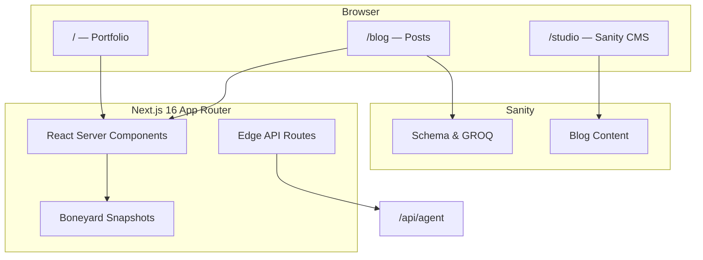

<div align="center">

# Hector Mendoza

**Senior Software Engineer · Head of Web Integrations**

A refined personal portfolio and writing platform — motion-rich, content-driven, and built for the modern web.

<br />

[](https://hectormendoza.me)
[](https://nextjs.org)
[](https://react.dev)
[](https://sanity.io)
[](https://tailwindcss.com)

<br />

[Visit Site](https://hectormendoza.me) · [Blog](https://hectormendoza.me/blog) · [Studio](https://hectormendoza.me/studio) · [Contact](mailto:hey@hectormendoza.me)

</div>

---

## Overview

This repository powers [hectormendoza.me](https://hectormendoza.me) — a single-page portfolio experience paired with a Sanity-backed blog. Every surface is designed with intention: glassmorphic depth, choreographed motion, skeleton-first loading, and machine-readable metadata for agents and crawlers.

The result is a fast, accessible site that reads like a product — not a template.

---

## Highlights

<table>
<tr>
<td width="50%" valign="top">

### Experience-first home

A bento-style hero anchors the page — identity, stack, social presence, and interactive moments arranged in a responsive grid. Scroll-driven reveals, mouse-reactive glow, and Framer Motion orchestration give the first impression weight without sacrificing performance.

</td>
<td width="50%" valign="top">

### Editorial blog

Long-form writing lives in Sanity CMS with Portable Text, syntax-highlighted code blocks, and structured metadata. Drafts, previews, and a built-in Studio at `/studio` keep publishing effortless.

</td>
</tr>
<tr>
<td width="50%" valign="top">

### Instant perceived speed

[Boneyard](https://github.com/hectormendoza/boneyard-js) snapshots pre-render skeleton states so routes feel populated the moment navigation begins — no layout shift, no empty flash.

</td>
<td width="50%" valign="top">

### Agent-ready by design

Structured endpoints (`/api/agent`, `/llms.txt`, `/robots.txt`) expose profile, projects, and crawl rules in formats both humans and AI systems can consume.

</td>
</tr>
</table>

---

## Architecture



| Layer | Technology |
| --- | --- |
| Framework | Next.js 16 · React 19 · App Router |
| Styling | Tailwind CSS 4 · CSS custom properties · Outfit & JetBrains Mono |
| Motion | Framer Motion · scroll-linked animations |
| Content | Sanity 6 · Portable Text · embedded Studio |
| Loading | Boneyard JS · route-level skeletons |
| Quality | Vitest · Testing Library · ESLint |

---

## Project Structure

```
app/
├── page.jsx              # Home — hero, projects, experience, contact
├── blog/                 # Blog index & dynamic post routes
├── studio/               # Sanity Studio (embedded CMS)
├── bones/                # Boneyard snapshot target
└── api/                  # Agent metadata & crawl rules

components/               # Sections, blog UI, shared primitives
lib/                      # Utilities & blog helpers
sanity/                   # Schema, client, GROQ queries
bones/                    # Pre-built skeleton snapshots
public/                   # Static assets, llms.txt
```

---

## Getting Started

### Prerequisites

- **Node.js** 20+
- **npm** 10+
- A [Sanity](https://www.sanity.io/manage) project *(optional — the home page runs without CMS credentials)*

### Installation

```bash
git clone https://github.com/hectormendoza/portfolio.git
cd portfolio
npm install
```

### Environment

Copy the example env file and add your Sanity credentials when you're ready to connect the blog:

```bash
cp .env.local.example .env.local
```

| Variable | Description |
| --- | --- |
| `NEXT_PUBLIC_SANITY_PROJECT_ID` | Sanity project identifier |
| `NEXT_PUBLIC_SANITY_DATASET` | Dataset name (default: `production`) |
| `NEXT_PUBLIC_SANITY_API_VERSION` | API version date |
| `SANITY_API_READ_TOKEN` | Optional — enables draft preview |

### Development

```bash
npm run dev
```

Open [http://localhost:3000](http://localhost:3000) for the site, [http://localhost:3000/studio](http://localhost:3000/studio) for the CMS, and [http://localhost:3000/blog](http://localhost:3000/blog) for writing.

---

## Scripts

| Command | Description |
| --- | --- |
| `npm run dev` | Start the development server |
| `npm run build` | Create a production build |
| `npm run start` | Serve the production build |
| `npm run lint` | Run ESLint across the codebase |
| `npm test` | Run Vitest test suite |
| `npm run test:watch` | Run tests in watch mode |
| `npm run bones:build` | Rebuild Boneyard snapshots *(requires dev server)* |
| `npm run sanity` | Launch Sanity Studio standalone |
| `npm run sanity:deploy` | Deploy Studio to Sanity hosting |

---

## Content & Customization

| Surface | Where to edit |
| --- | --- |
| Hero, about, projects, experience, contact | `components/` section files |
| Blog posts | Sanity Studio at `/studio` |
| Theme & design tokens | CSS variables in `app/globals.css` |
| SEO & metadata | `app/layout.jsx` and route-level exports |
| Agent profile data | `app/api/agent/route.js` · `public/llms.txt` |

---

## License

Open source — fork freely and make it yours.

---

<div align="center">

**Built with care by [Hector Mendoza](https://hectormendoza.me)**

[GitHub](https://github.com/hector-mendoza) · [LinkedIn](https://www.linkedin.com/in/hector-mendoza-m/) · [Threads](https://www.threads.com/@hectormendozax2)

</div>
